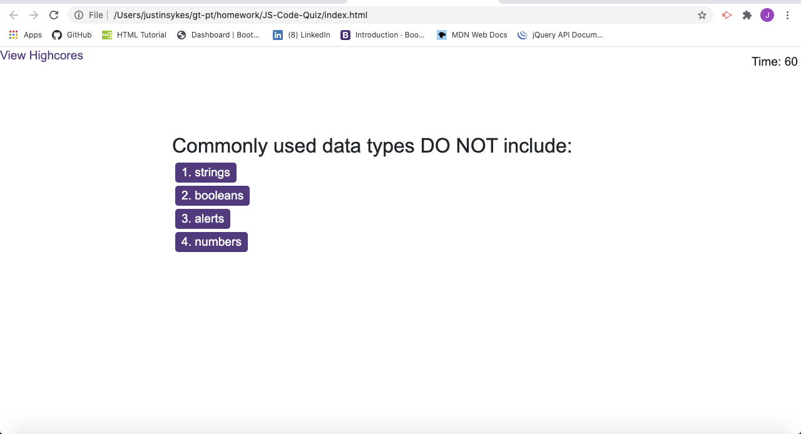

# JS-Code-Quiz

This is a timed quiz that has 4 questions. Once user clicks 'start', all questions are dynamically created through DOM manipulation. Each question has 4 responses that are presented as buttons below the question. Use is given 75 seconds to complete and receives a 15 second penalty for each wrong answer. User's also have the ability to save their high score and view a high score listing for all quiz takers (on a separate page).

URL of deployed app: https://204039643.github.io/02-responsive-portfolio/

- [Installation](#installation)
- [Usage](#usage)
- [Credits](#credits)
- [License](#license)

## Installation

Clone my Github repository to your local machine: https://github.com/204039643/JS-Code-Quiz

## Usage

1. Open local repository in VS code (code .).
2. Navigate to the index.html, style.css, or script.js files in the editor to view.
3. To view in your web browser, with the index.html file selected in the editor, right-click and select 'Open in default browser'.
4. Click the 'Start' button to begin quiz.
5. Answer all 4 questions by clicking one of the 4 answer buttons.
6. When complete, submit your initials to track your high score.
7. You will be directed to a new page that lists all the cached high scores.

## Credits

W3C Schools HTML JavaScript: https://www.w3schools.com/js/default.asp
MDN web dics JavaScript: https://developer.mozilla.org/en-US/docs/Web/JavaScript

## License

MIT License

Copyright (c) [2020] [Justin Sykes]

Permission is hereby granted, free of charge, to any person obtaining a copy
of this software and associated documentation files (the "Software"), to deal
in the Software without restriction, including without limitation the rights
to use, copy, modify, merge, publish, distribute, sublicense, and/or sell
copies of the Software, and to permit persons to whom the Software is
furnished to do so, subject to the following conditions:

The above copyright notice and this permission notice shall be included in all
copies or substantial portions of the Software.

THE SOFTWARE IS PROVIDED "AS IS", WITHOUT WARRANTY OF ANY KIND, EXPRESS OR
IMPLIED, INCLUDING BUT NOT LIMITED TO THE WARRANTIES OF MERCHANTABILITY,
FITNESS FOR A PARTICULAR PURPOSE AND NONINFRINGEMENT. IN NO EVENT SHALL THE
AUTHORS OR COPYRIGHT HOLDERS BE LIABLE FOR ANY CLAIM, DAMAGES OR OTHER
LIABILITY, WHETHER IN AN ACTION OF CONTRACT, TORT OR OTHERWISE, ARISING FROM,
OUT OF OR IN CONNECTION WITH THE SOFTWARE OR THE USE OR OTHER DEALINGS IN THE
SOFTWARE.
